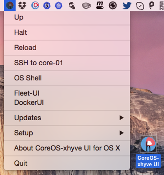

CoreOS-xhyve UI for OS X
============================

CoreOS-xhyve UI for Mac OS X is a Mac Status bar App which works like a wrapper around the [coreos-xhyve](https://github.com/coreos/coreos-xhyve) command line tool. It supports only a standalone CoreOS VM, cluster one (Vagrant based) is at [CoreOS-Vagrant Cluster GUI](https://github.com/rimusz/coreos-osx-gui-cluster).

Fully supports etcd2 in all CoresOS channels.





How to install CoreOS-xhyve UI
----------

**WARNING**
 -----------
  - [xhyve](https://github.com/mist64/xhyve) is a very new project, but is very cool already! You must be running OS X 10.10.3 Yosemite or later and 2010 or later Mac for this to work.
  - if you use any version of VirtualBox prior to 5.0 then xhyve will crash your system either if VirtualBox is running or had been run previously after the last reboot (see xhyve's issues [#5](mist64/xhyve#5) and [#9](mist64/xhyve#9) for the full context). So, if you are unable to update VirtualBox to version 5, or later, and were using it in your current session please do restart your Mac before attempting to run xhyve.


####Required software:
* The only required software is [iTerm 2](http://www.iterm2.com/#/section/downloads) 
* As [xhyve](https://github.com/mist64/xhyve) is integreted to the App.

####Download:
* Download `CoreOS-xhyve UI latest.dmg` from the [Releases Page](https://github.com/rimusz/coreos-xhyve-ui/releases), open it and drag the App e.g to your Desktop.

###Install:
* Start the `CoreOS-xhyve UI` and from menu `Setup` choose `Initial setup of CoreOS-xhyve UI` 
* The install will do the following:

````
1) All dependent files/folders will be put under "coreos-xhyve-ui" folder in the user's home 
 folder e.g /Users/someuser/coreos-xhyve-ui
2) user-data file will have fleet, etcd, and Docker Socket for the API enabled
3) Will download latest vagrant VBox and run "vagrant up" to initialise VM with docker 2375 port pre-set for docker OS X client
4) Will download and install fleet, etcd and docker OS X clients to ~/coreos-xhyve-ui/bin/
5) A small shell script "rkt" will be installed to ~/coreos-xhyve-ui/bin/ which allows to call remote rkt binary on CoreOS VM with e.g rkt help
6) docker-exec script (docker exec -it $1 bash -c 'export TERM=xterm && bash') is installed 
 into ~/coreos-xhyve-ui/bin/ too, which allows to enter container with just a simple command:
 docker-exec container_name 
7) Will install DockerUI and Fleet-UI via unit files
8) Via assigned static IP (it will be shown in first boot and will survive VM's reboots) you can access any port on CoreOS VM
9) user-data file enables docker flag `--insecure-registry` to access insecure registries.
10) Extra persistant disk will be created and mounted to /var/lib/docker
````

How it works
------------

Just start `CoreOS-xhyve UI` application and you will find a small icon with the CoreOS logo with `h`in the Status Bar.

* There you can `Up`, `Halt`, `Reload` CoreOS VM
* `SSH to core-01` (vagrant ssh) will open VM shell
* `Attach to VM's console` will open console
* Under `Up` OS Shell will be opened when VM boot finishes up and it will have such environment pre-set:

````
DOCKER_HOST=tcp://assigned_static_ip:2375
ETCDCTL_PEERS=http://assigned_static_ip:2379
FLEETCTL_ENDPOINT=http://assigned_static_ip:2379
FLEETCTL_DRIVER=etcd
Path to ~/coreos-xhyve-ui/bin where docker and fleetctl binaries, rkt and etcdclt shell 
scripts are stored
```` 
Also under 'Up" local webserver `python -m SimpleHTTPServer 18000` serves customized local user-data.

* `OS Shell` opens OS Shell with the same enviroment preset as `Up`
* `Updates/Check updates for OS X fleetctl and docker clients` will update fleet and docker OS X clients to the same versions as CoreOS VM runs.
* `Updates/Fetch latest CoreOS ISO` will download the lasted CoreOS ISO file for the currently set release channel. 
* [Fleet-UI](http://fleetui.com) dashboard will show running `fleet` units and etc
* [DockerUI](https://github.com/crosbymichael/dockerui) will show all running containers and etc
* Put your fleet units into `~/coreos-xhyve-ui/fleet` and they will be automaticly deployed on each VM boot.
* This App has as much automation as possible to make easier to use CoreOS on OS X, e.g. you can change CoreOS release channel and reload VM and your downloaded docker images will remain stored in an extra persistant disk. 

To-dos
-----------
* Mount /Users folder via nfs to CoreOS VM


Credits
-----------
* To [Michael Steil](https://github.com/mist64) for the awesome [xhyve](https://github.com/mist64/xhyve) lightweight OS X virtualization solution
* To CoreOS team for [coreos-xhyve](https://github.com/coreos/coreos-xhyve) version
* To [Antonio Meireles](https://github.com/AntonioMeireles) for his awesome tweaks spree to improve coreos-xhyve

Other links for Vagrant based VMs
-----------
* A standalone CoreOS VM version of OS X App can be found here [CoreOS-Vagrant GUI](https://github.com/rimusz/coreos-osx-gui).
* Cluster one CoreOS VM App can be found here [CoreOS-Vagrant Cluster GUI](https://github.com/rimusz/coreos-osx-gui-cluster).
* A standalone Kubernetes CoreOS VM App can be found here [CoreOS-Vagrant Kubernetes Solo GUI](https://github.com/rimusz/coreos-osx-gui-kubernetes-solo).
* Kubernetes Cluster one CoreOS VM App can be found here [CoreOS-Vagrant Kubernetes Cluster GUI ](https://github.com/rimusz/coreos-osx-gui-kubernetes-cluster).

